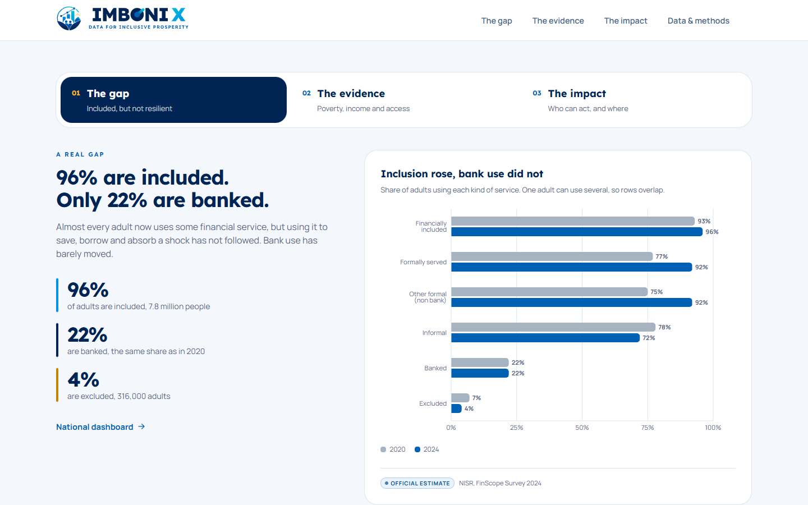
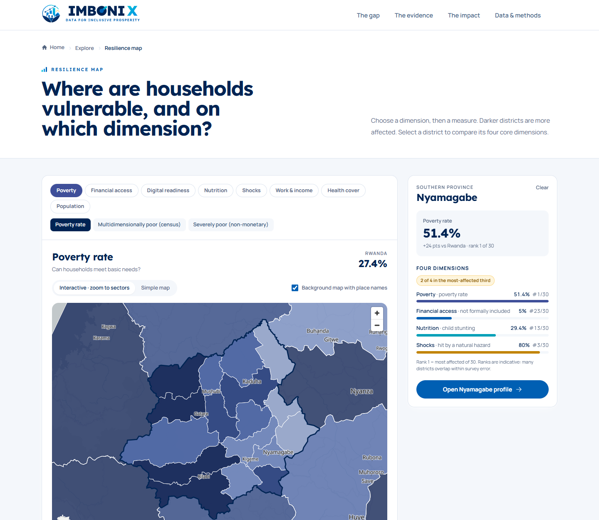
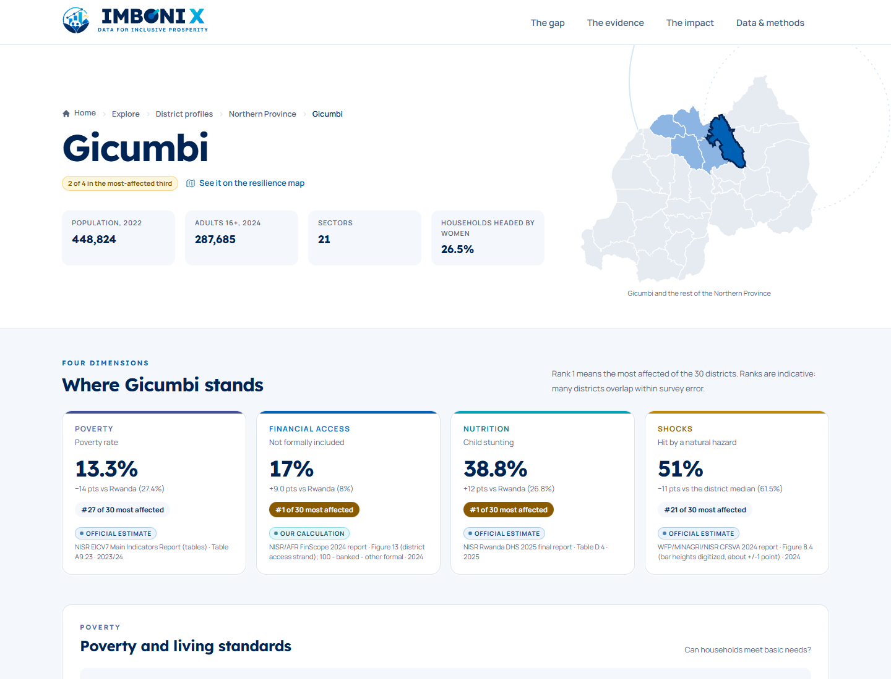
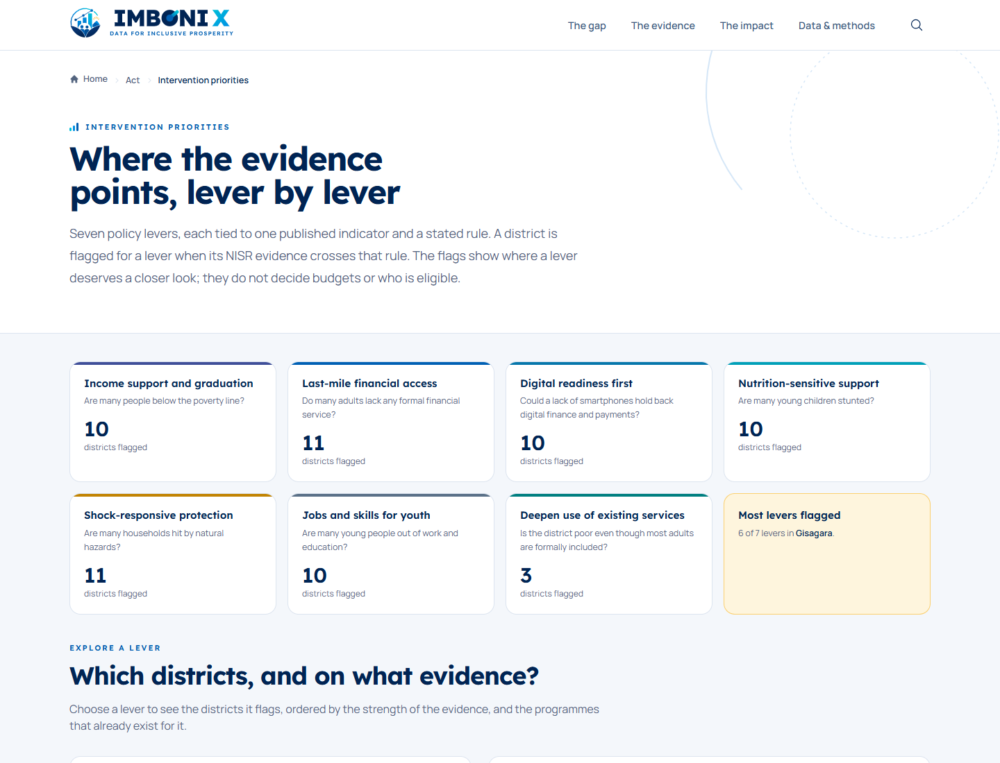
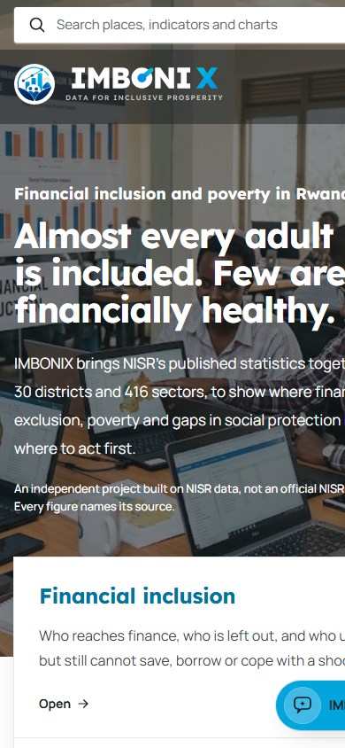
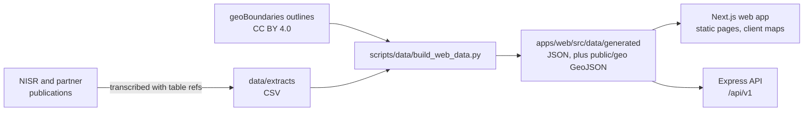

<p align="center">
  
</p>

<h1 align="center">IMBONIX</h1>

<p align="center">
  <strong>IMBONIX turns Rwanda's data into actionable intelligence for financial inclusion and poverty reduction.</strong><br>
  NISR 2026 Big Data Hackathon · Track 2: Financial Inclusion &amp; Poverty Reduction
</p>

<p align="center">
  <a href="https://github.com/dieumerci-niyonkuru/imbonix-nisr-hackathon-2026/actions/workflows/ci.yml"></a>
</p>

<p align="center">
  <a href="#getting-started">Getting started</a> ·
  <a href="docs/architecture.md">Architecture</a> ·
  <a href="docs/api.md">API</a> ·
  <a href="docs/deployment.md">Deployment</a> ·
  <a href="CONTRIBUTING.md">Contributing</a>
</p>

---

## Overview

Almost every Rwandan adult is counted as financially included (96% in FinScope 2024). Yet poverty, poor nutrition, natural
hazards and late social-protection payments are concentrated in different districts. A district that looks fine on one
measure can be among the worst on another.

IMBONIX puts NISR's published statistics side by side for all **30 districts** and **416 sectors**, so planners can see
where vulnerabilities overlap and which policy levers the evidence points to. Every number carries its source, table, year
and a status label, and uncertainty is shown wherever NISR publishes it.

IMBONIX is an independent team project. It is **not an official NISR product** and does not imply NISR endorsement.



## Features

| Area | What it does |
| --- | --- |
| **Homepage** | One argument in three tabs: the gap (96% included, 10% financially healthy), the evidence in NISR data on poverty, income and access, and the impact for households, policymakers and civil society. |
| **Map of every district** | 28 measures in 8 dimensions on an interactive MapLibre map. Select a district to zoom to its sectors, shaded by small-area poverty estimates. Links can be shared (`/map?layer=…&district=…`). |
| **District profiles** | 30 profiles with four-dimension ranks, every indicator with its confidence interval, and a sector table and map. |
| **Dashboard** | National inclusion, poverty trends and progress towards national targets. |
| **Vulnerability analysis** | Where poverty, financial exclusion, nutrition and shocks overlap, with correlations between districts. |
| **Access vs use** | FinScope's 96% inclusion compared with DHS 2025 account and mobile-money use, by sex and wealth. |
| **Social protection** | How VUP payments reach households: channels, and how late they arrive. |
| **Intervention priorities** | Seven policy levers, each tied to one indicator and a stated rule, showing which districts each lever flags and why. |
| **Scenario simulator** | Test inclusion targets (how many adults each district would need to reach) and priority weights. |
| **Explainable model** | The design of a model of financial vulnerability, with features checked against the FinScope 2024 dictionary. Results appear only after it is trained on the microdata. |
| **Public data API** | Read-only JSON endpoints for districts, indicators and sectors, with validation, rate limiting and security headers. |

<table>
  <tr>
    <td></td>
    <td></td>
  </tr>
  <tr>
    <td></td>
    <td align="center"></td>
  </tr>
</table>

## How the data is handled

- **Only published figures.** District and sector values are transcribed from NISR and partner reports (EICV7, the 2022
  census, FinScope, DHS 2025, CFSVA 2024, LFS 2025 and others), each with its table reference.
- **Every value is labelled** as an official estimate, our calculation, a model estimate, a projection or a scenario.
- **No composite score.** The dimensions are shown side by side, and ranks are presented as indicative.
- **No causal claims.** The surveys are cross-sections; the site describes associations between places, not households.
- **No microdata in git.** Survey microdata stays in ignored folders, under NISR's terms of use.
- **Reproducible.** `scripts/data/build_web_data.py` rebuilds the website data from the committed extracts, and CI checks
  that the result matches exactly.

See [docs/database.md](docs/database.md) for the data model, and the site's **Data & methods** page (`/data`) for every
source and caveat.

## Design

- **Two colours, one palette.** Every colour on the site comes from `apps/web/src/lib/palette.ts`: deep navy
  (`#022657`) and bright cyan (`#02A5DC`) on white, in the manner of Rwanda's government sites, with a deeper cyan
  (`#01749C`) for links and small text. Map and chart scales are steps of the same two hues plus a neutral grey,
  generated by `scripts/brand/generate_palette.py` and checked for colour-vision deficiencies. A test fails if a
  component writes its own colour.
- **Vector logo.** The emblem, wordmark and tagline are crisp SVG files in `apps/web/public/brand/`, with light and dark
  versions, lockups, a simplified favicon mark and app icons.
- **Minimal.** The header links only the three focus areas and Data & methods. Charts follow the FinScope report's
  infographic style, and every inner page has breadcrumbs.
- **Accessible.** No axe (WCAG 2.1 A and AA) violations on any page at 320, 390 and 1440px, no horizontal scrolling
  from 320px up, and every text colour at 4.5:1 or better.

## Tech stack

| Layer | Tools |
| --- | --- |
| Web app | Next.js 15 (App Router), React 19, TypeScript, Tailwind CSS, shadcn/ui patterns with Radix primitives |
| Charts and maps | Recharts, custom SVG charts, MapLibre GL with OpenFreeMap tiles, geoBoundaries outlines |
| API | Node.js 22, Express 5, zod validation, helmet, express-rate-limit |
| Data pipeline | Python 3.12+ (standard library for the build; openpyxl and xlrd for extraction) |
| Quality | Vitest, node:test with supertest, Python unittest, ESLint, Prettier, gitleaks, npm audit |
| Delivery | Docker (multi-stage images), docker compose, GitHub Actions |

## Architecture



There is no database: the site serves a small, versioned set of published aggregates. Details are in
[docs/architecture.md](docs/architecture.md).

## Getting started

### Prerequisites

- Node.js **22.9 or later** and npm 10
- Python **3.12 or later** (only to rebuild the data)
- Docker Desktop (optional, to run the production images)

### Install and run

```bash
git clone git@github.com:dieumerci-niyonkuru/imbonix-nisr-hackathon-2026.git
cd imbonix-nisr-hackathon-2026

# Web app on http://localhost:3000
cd apps/web
npm ci
npm run dev

# API on http://localhost:4000 (in a second terminal)
cd apps/api
npm ci
npm run dev
```

The website does not depend on the API: both read the same generated data.

### Environment variables

No secrets are needed to run IMBONIX. Every setting has a safe default, and each app documents its variables in its
`.env.example`:

| App | Variables |
| --- | --- |
| API ([apps/api/.env.example](apps/api/.env.example)) | `NODE_ENV`, `PORT`, `HOST`, `CORS_ORIGINS`, `RATE_LIMIT_PER_MINUTE`, `TRUST_PROXY`, `LOG_LEVEL`, `DATA_DIR` |
| Web ([apps/web/.env.example](apps/web/.env.example)) | `NEXT_PUBLIC_API_URL` (reserved; the site does not call the API yet) |

Copy a `.env.example` to `.env` for local changes. `.env` files are ignored by git and must never be committed.

### Run with Docker

```bash
docker compose up --build
```

This serves the web app on <http://localhost:3000> and the API on <http://localhost:4000>. See
[docs/deployment.md](docs/deployment.md).

## Tests and checks

| Where | Command | What it covers |
| --- | --- | --- |
| `apps/web` | `npm test` | Formatting helpers, colour scales, generated-data integrity, province weighting against the published national rates, published homepage findings, priority rules, scenarios, correlations, sector colours |
| `apps/web` | `npm run lint`, `npm run typecheck`, `npm run format:check`, `npm run build` | ESLint (Next.js and accessibility rules), TypeScript, Prettier, production build |
| `apps/api` | `npm test` | Every endpoint, validation, errors, rate limits, CORS, security headers, logging and configuration |
| repository root | `python -m unittest discover -s scripts/data/tests -v` | Build helpers, extract integrity, and that the website data rebuilds exactly |

GitHub Actions runs all of these on every push and pull request, plus `npm audit`, a gitleaks secret scan of the full
history, and a Docker build that starts both images and waits for their health checks.

## API

```bash
curl http://localhost:4000/api/v1/districts/nyamagabe?indicators=eicv7_poverty_rate
```

```json
{
  "data": {
    "name": "Nyamagabe",
    "slug": "nyamagabe",
    "province": "South",
    "sectorCount": 17,
    "values": [
      {
        "indicator": { "id": "eicv7_poverty_rate", "label": "Poverty headcount (% of people)", "source": "NISR EICV7 Main Indicators Report (tables)", "table": "Table A9.23", "year": "2023/24", "status": "observed" },
        "value": 51.3941, "standardError": 3.214, "ciLow": 45.09, "ciHigh": 57.6982
      }
    ]
  },
  "meta": {}
}
```

All endpoints, parameters and error codes are in [docs/api.md](docs/api.md).

## Project structure

```text
apps/
  web/              Next.js app: pages (src/app), components, lib (data, scales, rules), generated data
  api/              Express API: routes, middleware, data store, tests
data/
  extracts/         Published NISR tables transcribed to CSV: the source of every figure on the site
  dictionaries/     NISR microdata catalog index and variable dictionaries
  schemas/          JSON schema for an indicator
                    (raw and working survey files stay local in data/raw, never committed)
scripts/
  data/             Extraction and build scripts for the published data, with tests
  brand/            Generates the logo files and the colour palette
docs/
  data/             Data sources plan, data inventory, microdata access
  research/         Hackathon brief and the Track 2 research dossier
  model/  project/  submission/  screenshots/
                    Architecture, API, data model, deployment, security and development guides at the top level
.github/            CI workflow, Dependabot, issue and pull request templates, CODEOWNERS
```

## Deployment

The web app and API each have a production Dockerfile, and `docker-compose.yml` runs both. Both images have been built,
started and checked locally. **IMBONIX has not been deployed to a public host yet.** [docs/deployment.md](docs/deployment.md)
covers hosting options, settings and a release checklist.

## Security

No secrets are required or stored; configuration comes from environment variables. The web app sends a Content Security
Policy and related headers. The API validates every parameter, rate-limits requests and never exposes internal errors.
Report vulnerabilities privately as described in [SECURITY.md](SECURITY.md); controls and the GitHub settings to enable
are in [docs/security.md](docs/security.md).

## Contributing

Work happens on `feature/*`, `fix/*`, `security/*`, `docs/*` and `chore/*` branches cut from `develop` and merged back
once the checks pass. `develop` moves to `testing` for integration checks, and `main` changes only through a pull request
from `testing`. Commits follow Conventional Commits. See [CONTRIBUTING.md](CONTRIBUTING.md) and
[docs/development.md](docs/development.md).

## Team

| Name | Role | GitHub |
| --- | --- | --- |
| Dieu Merci Niyonkuru | Team lead, development and data | [@dieumerci-niyonkuru](https://github.com/dieumerci-niyonkuru) |

<!-- Add the other team members here. -->

## Data sources and attribution

- Statistics: **National Institute of Statistics of Rwanda (NISR)** and partners (MINAGRI and WFP for CFSVA 2024; Access
  to Finance Rwanda for FinScope), as cited on each page and in the extracts.
- NISR microdata catalog: <https://microdata.statistics.gov.rw/index.php/catalog>
- District and sector boundaries: [geoBoundaries](https://www.geoboundaries.org/) (CC BY 4.0), from NISR open geodata.
- Background map: [OpenFreeMap](https://openfreemap.org/), © OpenMapTiles, data from OpenStreetMap contributors.

## AI assistance

Parts of the code and documentation were written with AI assistance. The team reviewed the work and is responsible for
every figure and claim. See [docs/submission/ai-disclosure.md](docs/submission/ai-disclosure.md).

## License

No open-source licence has been chosen yet, so all rights are reserved by the team for now. The competition's
intellectual-property terms and NISR's data terms of use also apply; the team will choose a licence after reviewing them.
Data remains subject to its publishers' terms.
