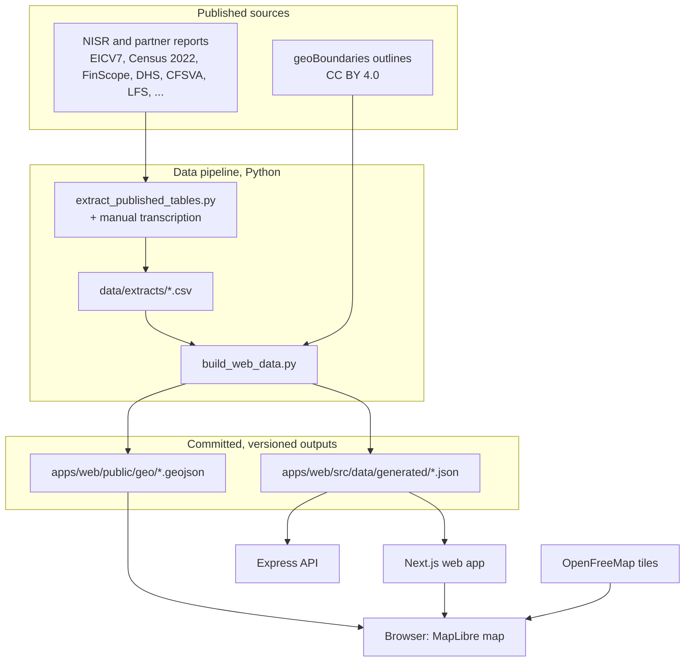

# Architecture

IMBONIX is a small monorepo with two deployable apps that read the same published data. This page explains how data flows
through it, how each app is built, and why it is shaped this way.

## Overview



1. **Sources.** Figures are taken from NISR's published reports and tables, never from restricted microdata. Each row of the
   extracts records its publication, table, year, status and, where published, its standard error and confidence interval.
2. **Build.** `scripts/data/build_web_data.py` turns the extracts and boundary files into compact JSON for the site and
   GeoJSON for the interactive map. The output is committed, so building the website needs neither Python nor network
   access.
3. **Serve.** The web app imports the JSON at build time and prerenders almost every page. The API loads the same JSON into
   memory at startup.

A CI test rebuilds `districts.json`, `usage.json` and `vup.json` from the extracts and fails if they differ from the
committed files, so the website data can never drift from its documented sources.

## Web app (`apps/web`)

| Concern | Approach |
| --- | --- |
| Framework | Next.js 15 App Router, React 19, TypeScript in strict mode |
| Styling | Tailwind CSS with design tokens (brand scale, dimension ramps), shadcn/ui-style components on Radix primitives |
| Rendering | Most pages are static; the 30 district pages are generated at build time (`generateStaticParams`); `/map` renders per request because it reads `?layer=&district=` on the server so shared links open in the right state; `/api/health` is dynamic |
| Charts | Hand-built SVG charts (rank bars, dumbbells, small multiples, matrices) and Recharts for time series; every chart has a table or text alternative |
| Maps | A lightweight SVG map everywhere, and an interactive MapLibre GL map on `/map`, loaded only in the browser (`next/dynamic`, about 800 KB) with an SVG fallback when WebGL is missing |
| States | `loading.tsx` (skeleton), `error.tsx` (recoverable, keeps navigation), `global-error.tsx` (self-contained), `not-found.tsx` |
| Security | Content Security Policy and related headers in `next.config.mjs`; the only outside host is the basemap |
| Output | Docker builds set `NEXT_OUTPUT=standalone`, so the image contains only the files the server needs; local builds use the default output and `npm run start` |

### Source layout

```text
apps/web/src/
  app/                 Routes: one folder per page, plus api/health, loading, error and not-found states
  components/
    layout/            Header, footer, navigation data, logo
    ui/                Buttons, cards, badges, sheets, sliders, status badges, section headers
    charts/            SVG charts; charts/recharts/ holds the Recharts-based ones
    map/               SVG map, MapLibre map, map explorer and legend
    district/, home/, priorities/, scenarios/, usage/   Page-specific components
  lib/
    data.ts            Loads the generated data; ranks, medians and national references
    indicators.ts      Presentation metadata per indicator (dimension, direction, format)
    scales.ts          Quantile colour scales (darker always means more vulnerable)
    priorities.ts      The seven policy levers and their rules
    scenarios.ts       Reach and weighted-priority calculations
    *.test.ts          Unit tests (Vitest)
  data/generated/      JSON written by the build script (do not edit by hand)
```

### Design rules that the code enforces

- **Darker means more vulnerable** on every map and scale, whichever direction is "better" for the indicator
  (`scaleFor` reverses the ramp for measures where higher is better).
- **Status on every value.** `STATUS_LABEL` and the status badge cover observed, calculated, model estimate, projection
  and scenario values.
- **No composite index.** Priority weights are an explicit, user-controlled scenario, compared against equal weights.
- **One palette, from the logo.** Colours come only from `lib/palette.ts` (the logo's navy, blue, azure, cyan and gold,
  and scales built from them); `palette.test.ts` fails on any other hex colour or Tailwind default colour family.
- **Colour palettes were validated** for colour-vision deficiencies; every ramp step takes navy or white text at 4.5:1
  (`textOn` picks whichever contrasts more).

## API (`apps/api`)

A read-only Express 5 service over the same data. It exists so other tools (notebooks, dashboards, partners) can use the
figures with their provenance, without scraping the site.

```text
apps/api/src/
  server.js            Startup: config, data loading, listen, graceful shutdown
  app.js               Express app: middleware order, routers, 404 and error handlers
  config.js            Validated settings from environment variables
  services/data-store.js   Loads and indexes districts, indicators and sectors
  routes/              health, indicators, districts (zod-validated)
  middleware/          request ids and access logs, validation, JSON errors
  utils/               logger, HttpError, response helper
```

Request path: request id and access log → helmet headers → CORS allow-list → (for `/api/v1`) rate limit → cache headers →
route validation → handler → `{ data, meta }`, or `{ error }` from the error handler. See [api.md](api.md).

## Why there is no database

The data is small (about 0.5 MB), changes only when NISR publishes new tables, and must stay traceable to those tables.
Versioned files in git give review, history and reproducibility for free, and the site can be served as static pages.
A database would add a service to secure, back up and keep in sync without adding capability. [database.md](database.md)
describes the data model and when that decision should be revisited.

## Planned: household-level analysis

The model page describes a weighted, explainable model of financial vulnerability on FinScope 2024 microdata. That work
would live in a new `ml/` folder, run offline on data that stays out of git, and would publish only aggregate, suppressed results into
the same extracts-and-build pipeline. No model has been trained yet.
