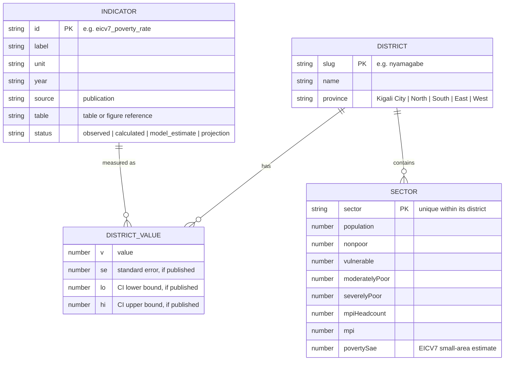

# Data model

IMBONIX has **no database**. It serves a small, versioned set of published aggregates as files. This page describes those
files, how they fit together, how to update them, and when a database would become worth adding.

## Files

| File | Written by | Contents |
| --- | --- | --- |
| `data/extracts/district_indicators_long.csv` | `extract_published_tables.py` and manual transcription | One row per district and indicator: value, SE, CI, unit, year, source, table, status |
| `data/extracts/sector_census2022.csv` | extraction script | All 416 sectors: population, non-monetary poverty categories, MPI |
| `data/extracts/sector_poverty_eicv7_sae.csv` | transcription | Sector small-area poverty estimates (EICV7) |
| `data/extracts/*.csv` (others) | extraction scripts | DHS usage by group, VUP delivery and timeliness, LFS series, and more; see the extracts README |
| `apps/web/src/data/generated/districts.json` | `build_web_data.py` | 30 districts × 64 indicators, with indicator metadata |
| `apps/web/src/data/generated/sectors.json` | `build_web_data.py` | 416 sectors grouped by district, with figures and SVG outlines |
| `apps/web/src/data/generated/geo.json` | `build_web_data.py` | District outlines as SVG paths |
| `apps/web/src/data/generated/usage.json`, `vup.json` | `build_web_data.py` | DHS 2025 usage and VUP delivery tables |
| `apps/web/public/geo/districts.geojson`, `sectors.geojson` | `build_web_data.py` | Simplified outlines in longitude/latitude for the interactive map |

The extracts are the source of truth. Generated files must not be edited by hand; CI rebuilds them and fails on any
difference.

## Entities

### Value status

| Status | Meaning | Example |
| --- | --- | --- |
| `observed` | An official estimate as published | EICV7 poverty rate by district |
| `calculated` | Arithmetic by IMBONIX on published figures, with the formula in the table field | Adults not formally included = 100 − banked − other formal |
| `model_estimate` | A published model output | Sector small-area poverty estimates |
| `projection` | A published projection | NISR population projections for 2024 and 2026 |
| `scenario` | Shown only in the simulator: arithmetic under the user's assumptions | Adults to reach for a target |

### Integrity rules (tested)

- 30 districts with unique slugs in five provinces, each with a map outline.
- Every displayed indicator has source metadata and a known status.
- Every published confidence interval contains its estimate.
- No indicator appears twice for the same district.
- The generated files equal a fresh build from the extracts.

## Updating the data

1. Add or correct rows in the relevant extract, with the publication, table, year and status. For a new indicator, also
   add its presentation metadata in `apps/web/src/lib/indicators.ts`.
2. Rebuild from the repository root: `python scripts/data/build_web_data.py`. The first run downloads the geoBoundaries
   outlines into the ignored `data/raw/geo/` folder.
3. Run the data tests (`python -m unittest discover -s scripts/data/tests -v`) and the web tests (`npm test` in
   `apps/web`).
4. Commit the extract and the regenerated files together, on a `feature/*` or `fix/*` branch.

## When to add a database

Revisit the decision if IMBONIX needs any of:

- data that changes without a code release (for example, partners submitting figures);
- user accounts, saved views or annotations;
- household-level results large enough that loading them into memory is impractical.

If so, PostgreSQL is the natural choice: the entities above map directly to tables, with `(district_slug, indicator_id)`
as the key for values. Credentials would come from environment variables, never from the repository.
