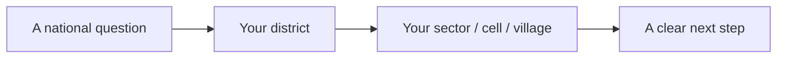
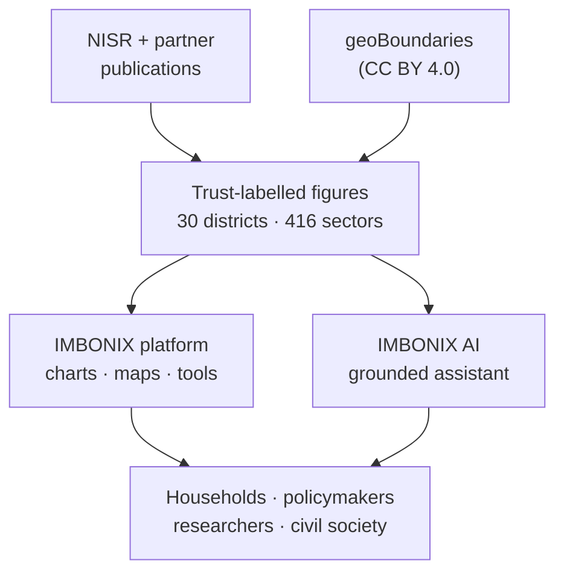
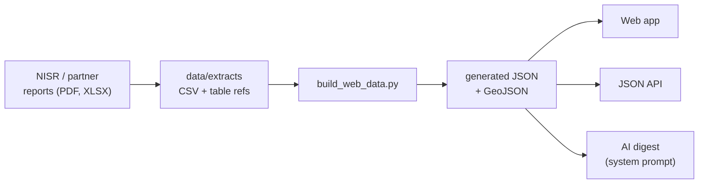

<div align="center">

# IMBONIX — Solution Overview

### Data for Inclusive Prosperity

**NISR Big Data Hackathon 2026 · Track 2 — Financial Inclusion & Poverty Reduction**

`Next.js 15` · `React 19` · `TypeScript` · `Grounded AI (Claude / Gemini)` · `Independent — not an official NISR product`

<em>Submission package:</em>
<a href="README.md">Index</a> ·
<strong>Solution overview</strong> ·
<a href="demo-script.md">Demo script</a> ·
<a href="../ai-assistant.md">IMBONIX AI</a> ·
<a href="ai-disclosure.md">AI disclosure</a>

</div>

---

> **The insight in one line.** Rwanda has all but solved *access* to finance — **96%** of adults are included
> (FinScope 2024). It has **not** solved *resilience*: only about **1 in 10** adults is financially healthy, and the
> households left behind cluster in the same districts where poverty, poor nutrition and shocks pile up. **IMBONIX makes
> that overlap visible — and asks it anything, in plain language.**


## Contents

1. [At a glance](#at-a-glance)
2. [The challenge](#the-challenge)
3. [The problem we name](#the-problem-we-name)
4. [The solution](#the-solution)
5. [How it works](#how-it-works)
6. [How we built it](#how-we-built-it) ← the engineering, end to end
7. [Judging scorecard](#judging-scorecard) ← the case, criterion by criterion
8. [Data & methodology](#data--methodology)
9. [Who benefits](#who-benefits)
10. [Alignment with Rwanda's priorities](#alignment-with-rwandas-priorities)
11. [Honest framing](#honest-framing)
12. [Run it](#run-it)

---

## At a glance

| | |
|---|---|
| **What it is** | An independent, open-source evidence platform for financial inclusion & poverty in Rwanda, with a grounded AI assistant. |
| **Coverage** | All **30 districts** and **416 sectors**; a search over every cell and village. |
| **Evidence** | NISR + partner publications (EICV7, FinScope, DHS, CFSVA, LFS, the 2022 census, and more), every figure **labelled for trust**. |
| **The twist** | It doesn't stop at charts — **IMBONIX AI** answers open questions about any place, grounded only in those figures, in **EN / FR / Kinyarwanda**, by **voice or text**, and can **read an uploaded chart or report**. |
| **Ends in** | Action: policy levers and priority districts flagged by **transparent, checkable rules**. |
| **Honesty** | Every number is NISR's, shown with its source; no invented figures; no microdata; describes places, never individuals. |

---

## The challenge

> **Track 2 — Financial Inclusion & Poverty Reduction.** *Use data to understand financial exclusion, poverty
> dynamics, and the impact of social protection programs in Rwanda.* Solutions should address a real gap or showcase
> financial-intervention impact; be informed by NISR data (with or without other open datasets); and offer tangible,
> practical impact to vulnerable households, policymakers or civil society.

In service of Rwanda's national goals — **Vision 2050**, **NST2**, the **National Financial Inclusion Roadmap
2025–2030** and the **Social Protection Sector Strategic Plan**. Here is exactly how IMBONIX answers the brief:

| The brief asks for… | How IMBONIX delivers it |
|---|---|
| **A real gap, or intervention impact** | We name the *access ≠ resilience* gap and map where poverty, exclusion, poor nutrition and shocks **overlap**; we track **VUP payment timeliness** and each district's **distance to its national target**. |
| **Informed by NISR data** (+ optional open data) | Every figure is transcribed from a named NISR or partner table (EICV7, FinScope, DHS, CFSVA, LFS, 2022 census…); maps add only open **geoBoundaries** outlines and **OpenFreeMap** tiles. |
| **Tangible impact for households / policymakers / civil society** | Five named audiences, each routed to the page they'd use; **priority districts** and an **intervention planner** that flag where to act first by a rule anyone can check. |

## The problem we name

Two gaps, named sharply:

- **A substantive gap — inclusion without resilience.** Access is near-universal, but *health* is not, and formal
  banking has been broadly flat since 2020. Being "included" does not mean being able to absorb a shock.
- **An evidence gap — the figures are scattered.** The numbers exist, but across many separate surveys, censuses and
  reports, unlabelled for trust, and hard for a non-specialist to turn into a decision.



IMBONIX is built to walk a user along exactly that line — from a headline to their own place to something they can do.

## The solution

**IMBONIX = one trustworthy evidence base + one way to ask it anything.**

1. **The platform** gathers NISR's published figures for every district and sector, **labels every value for trust**,
   and presents them as validated, accessible charts and maps organised around the questions people actually ask.
2. **IMBONIX AI** is a **grounded** assistant that answers open-ended questions — about any district, sector, cell or
   village — *only* from those published figures, in three languages, by voice or text, and can read an uploaded image
   or document. Full detail in [IMBONIX AI](../ai-assistant.md).

## How it works



The site is organised in four areas, in the calm style of Rwanda's government services (gov.rw / Irembo):

| Area | Answers | Highlights |
|---|---|---|
| **Financial exclusion** | Who is left out, and who is included but not resilient? | Access strand, financial health, an explainable vulnerability risk model |
| **Poverty dynamics** | Who is poor, where, and what has changed? | A validated district map, trends back to 1978, where needs overlap |
| **Social protection** | Who do programmes reach, and how well? | VUP payment timeliness, priority districts, a policy-scenario & intervention planner |
| **Data & About** | Where does every figure come from? | Every indicator with its table, year and trust label; a JSON API; the full method |

## How we built it

IMBONIX was engineered the way a government statistics product should be: **evidence first, every figure traceable,
every colour and claim governed by a test.** The build has seven pillars.

| Pillar | How we built it |
|---|---|
| **1 · Data pipeline** | Python scripts transcribe **named NISR/partner tables** to CSV, then `scripts/data/build_web_data.py` generates a small, **versioned JSON** dataset. CI re-runs it and **fails if the output doesn't match exactly**. Raw microdata stays in ignored folders — never committed. |
| **2 · Trust labelling** | Every value carries one of **six status labels** (official estimate · IMBONIX calculation · model estimate · projection · scenario · policy target) with its source, table and year, baked into the data model so nothing appears unlabelled. |
| **3 · Design system** | Two colours only (brand cyan + white), defined in **one palette module** — a test **fails the build if any component hardcodes a colour**. Every chart is validated for colour-vision deficiency and ships with a legend and a table view. |
| **4 · Platform** | **Next.js 15 (App Router)**, React 19 server/client components, **TypeScript strict**, Tailwind. Per-page metadata and breadcrumbs, permanent redirects for moved URLs, a site-wide search, and reduced-motion-aware scroll reveal. |
| **5 · IMBONIX AI** | A **same-origin route** grounds Claude **or** free-tier Gemini in the NISR digest, **streams** the answer, reads an attached image/PDF, resolves place names to their sector/district, and **falls back to a deterministic on-device engine** when no key is set. See [IMBONIX AI](../ai-assistant.md). |
| **6 · Quality & CI** | On **every push**: `typecheck`, ESLint (incl. accessibility), **88 unit tests**, Prettier, production `build`, `npm audit`, a **gitleaks** secret scan of the full history, and a Docker build that starts both images and waits for health checks. |
| **7 · Workflow** | Conventional Commits on `feature/*` → `develop` → `testing` → `main` (**main only by pull request**), so every change is reviewed and green before it lands. |

**The data journey, end to end:**



**How IMBONIX AI was built — the key decisions:**

| Decision | Why |
|---|---|
| **Grounding over training** | The whole NISR digest travels *with* each question, so answers come from published figures — and updating the data updates the assistant, with no retraining. |
| **Two interchangeable backends** | Claude when a key is present, else **free-tier Gemini** — so the full experience is demonstrable **at no cost**. |
| **Deterministic fallback** | If no key is set or the model is unreachable, an on-device engine answers from the same figures, so a demo **never** depends on a secret or the network. |
| **Multimodal + multilingual + voice** | Reads uploaded charts/reports; answers in **EN / FR / Kinyarwanda**; speaks and listens via the Web Speech API — built for non-technical users. |
| **Safe by construction** | Key read only server-side, never in the browser; per-IP rate limit; output, turn and attachment caps; declines off-topic requests; never invents a number. |

## Judging scorecard

The case for IMBONIX against the hackathon's five criteria (20 points each). Each row names **what judges look for**,
**our evidence**, and **where to see it in one click**.

| # | Criterion (20 pts) | Our evidence | See it |
|---|---|---|---|
| **1** | **Problem understanding & relevance** (NST2 / Vision 2050) | A sharp, non-obvious problem (access ≠ resilience) framed against four named national frameworks, each shown with its baseline. Every AI answer is framed **gap → evidence → solution → who it helps**. | Homepage gap chart + "Aligned to national priorities"; ask the assistant anything |
| **2** | **Data use & methodology** (NISR + external) | NISR + partners (ICF/DHS, WFP/CFSVA); **six trust labels** on every value; honest weighting of national/province figures; a **reproducible** pipeline; **no microdata**. | `/about#sources` ("Collected with" column), Method & Principles |
| **3** | **Tech innovation** | An explainable risk model and policy-scenario tools, plus a **grounded, streaming, multimodal, multilingual, voice-capable AI** with a two-backend design and a deterministic offline fallback. | `/financial-exclusion/risk-model`, `/social-protection/policy-scenarios`, IMBONIX AI |
| **4** | **Usability & design** | Government-style system, one governed palette, **colour-blind-validated** charts each with a legend and a table view, full keyboard/screen-reader support, site-wide search, scroll-reveal motion that respects reduced-motion. | Homepage, `/poverty-dynamics/district-map`, `/data/chart-library` |
| **5** | **Tangible impact** | Five named audiences each with the page they'd use; **priority districts** and an **intervention planner** that flag where to act first by a rule anyone can check. | `/social-protection/priority-districts`, `/social-protection/intervention-planner`, About → Who benefits |

> **Why this wins.** Most dashboards stop at "here are the numbers." IMBONIX pairs trustworthy, labelled NISR evidence
> with an assistant that turns it into an answer **for anyone** — a household, an officer, a researcher — and ends every
> path in a concrete, checkable next step. It is relevant, rigorous, innovative, usable **and** actionable at once.

## Data & methodology

- **NISR + external partners.** Figures come from EICV7, FinScope, the Rwanda DHS, the CFSVA, the Labour Force Survey,
  the 2022 census, the Establishment Census and more. About → Sources shows, per publication, how many indicators it
  gives and whether NISR collected it **with a partner** (ICF / The DHS Program; the World Food Programme).
- **Six trust labels.** Every value is one of: *official estimate · IMBONIX calculation · model estimate · projection ·
  scenario · policy target* — on screen with its source, table and year.
- **Honest aggregation.** NISR national/province figures are used where published; otherwise weighted up from districts
  and **labelled as calculations**. Sector poverty rates are NISR small-area estimates (a model), compared within a
  district, not across the country.
- **Reproducible & microdata-safe.** Scripts download the public files, extract the named tables and rebuild the data;
  CI checks the result matches exactly. **Microdata is never committed or published.** IMBONIX describes places and
  groups — never individuals.

## Who benefits

| Audience | What they get | Start here |
|---|---|---|
| Vulnerable households | Where support arrives late and finance is far | Social protection → VUP payments |
| Policymakers | Policy levers, each flagged by one published figure and a checkable rule | Social protection → Priority districts |
| Researchers | Every figure with its table, year and trust label; a JSON API; rebuild scripts | Data |
| Civil society | Open figures with sources, to follow programmes and speak for places left behind | Districts |
| Development partners | Where poverty, exclusion, poor nutrition and shocks overlap | Poverty dynamics → Overlapping needs |

It ends in action — seven policy levers, each flagging districts by one published figure and a stated, checkable rule:


## Alignment with Rwanda's priorities

IMBONIX tracks the national targets behind **Vision 2050** and **NST2** — financial inclusion and social protection —
and shows how far today's published figure is from each goal, each with its baseline: the **National Financial Inclusion
Roadmap 2025–2030** and the **Social Protection Sector Strategic Plan**.

## Honest framing

IMBONIX is independent and **not an official NISR product**. Every number is NISR's or its partners', shown with its
source; the analysis and framing are ours. It describes places and groups, never individuals, and presents relationships
as **associations, not causes**. It does not measure the impact of any programme — that needs household microdata over
time and a comparison group — and it says so.

## Run it

```bash
cd apps/web
npm install
npm run dev        # http://localhost:3000
```

Optionally set `ANTHROPIC_API_KEY` or a free `GEMINI_API_KEY` in `apps/web/.env` to turn on the generative AI layer;
without a key, IMBONIX AI answers from its on-device engine, so it is always demonstrable.

<div align="center">

**[↑ Back to top](#imbonix--solution-overview)** · [Demo script](demo-script.md) · [IMBONIX AI](../ai-assistant.md) · [Main README](../../README.md)

</div>
